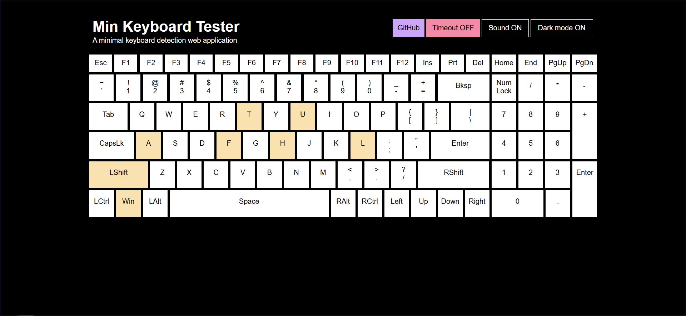
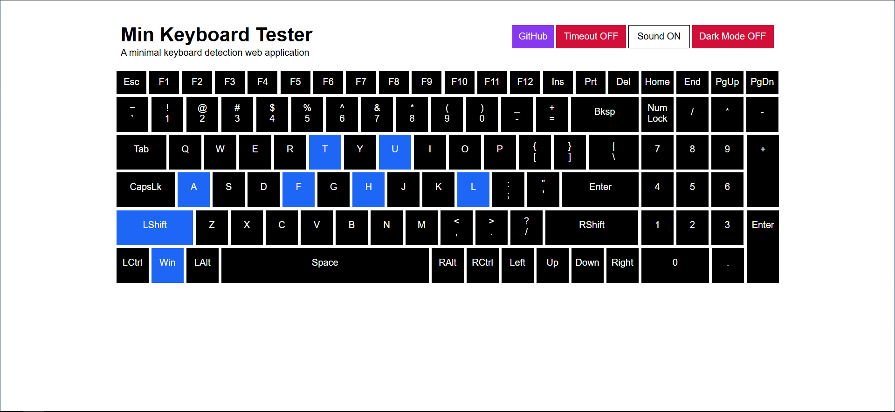
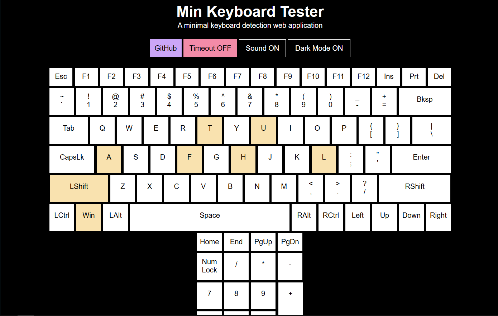
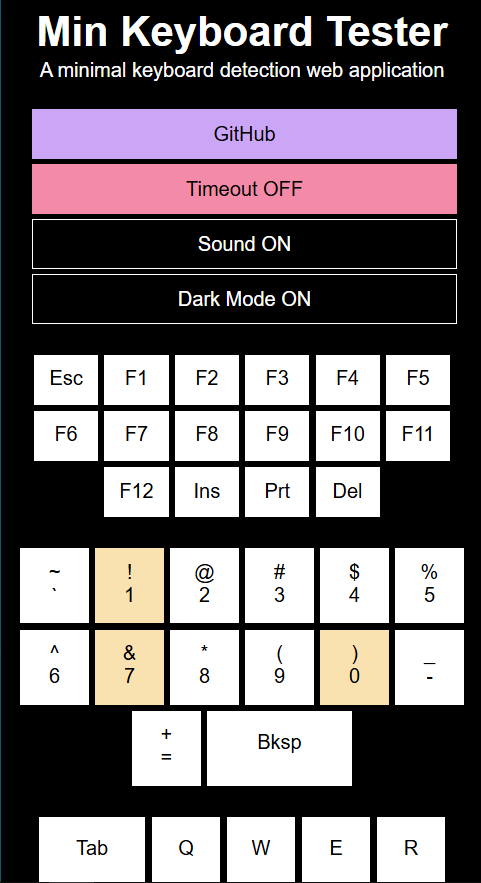

<!-- PROJECT SHIELDS -->

[![Contributors][contributors-shield]][contributors-url]
[![Forks][forks-shield]][forks-url]
[![Stargazers][stars-shield]][stars-url]
[![Issues][issues-shield]][issues-url]
[![MIT License][license-shield]][license-url]
[![LinkedIn][linkedin-shield]][linkedin-url]

<!-- PROJECT LOGO -->

 

  

  <h3 align="center">Min Keyboard Tester</h3>

  

   A web-based keyboard tester to detect keystrokes and provide visual and auditory indicators.
     
     
    <a href="https://github.com/fathulfahmy/min-keyboard-tester/issues/new?labels=bug&template=bug-report---.md">Report Bug</a>
    &middot;
    <a href="https://github.com/fathulfahmy/min-keyboard-tester/issues/new?labels=enhancement&template=feature-request---.md">Request Feature</a>
  

<!-- TABLE OF CONTENTS -->

## Table of Contents

<ol>
  <li>
    <a href="#about-the-project">About The Project</a>
    <ul>
      <li><a href="#built-with">Built With</a></li>
    </ul>
  </li>
  <li>
    <a href="#getting-started">Getting Started</a>
    <ul>
      <li><a href="#installation">Installation</a></li>
    </ul>
  </li>
  <li><a href="#demo">Demo</a></li>
  <li><a href="#contributing">Contributing</a></li>
  <li><a href="#license">License</a></li>
  <li><a href="#contact">Contact</a></li>
  <li><a href="#acknowledgments">Acknowledgments</a></li>
</ol>

<!-- ABOUT THE PROJECT -->

## About The Project

![product-screenshot]

Min Keyboard Tester is a web-based keyboard tester to detect keystrokes and provide visual and auditory indicators using jQuery, HTML, and CSS.

(<a href="#readme-top">back to top</a>)

### Built With

- ![jquery-badge]
- ![html-badge]
- ![css-badge]

(<a href="#readme-top">back to top</a>)

<!-- GETTING STARTED -->

## Getting Started

### Installation

No installations required. Go to https://min-keyboard-tester.pages.dev

(<a href="#readme-top">back to top</a>)

<!-- DEMO EXAMPLES -->

## Demo

<table>
   <tr>
      <td></td>
      <td></td>
   </tr>
   <tr>
      <td>Desktop (Dark)</td>
      <td>Desktop (Light)</td>
   </tr>
   <tr>
      <td></td>
      <td></td>
   </tr>
   <tr>
      <td>Tablet</td>
      <td>Mobile</td>
   </tr>
</table>

(<a href="#readme-top">back to top</a>)

<!-- CONTRIBUTING -->

## Contributing

Contributions are what make the open source community such an amazing place to learn, inspire, and create. Any contributions you make are **greatly appreciated**.

If you have a suggestion that would make this better, please fork the repo and create a pull request. You can also simply open an issue with the tag "enhancement".
Don't forget to give the project a star! Thanks again!

1. Fork the Project
2. Create your Feature Branch (`git checkout -b feature/amazing-feature`)
3. Commit your Changes (`git commit -m 'feat: add amazing feature'`)
4. Push to the Branch (`git push origin feature/amazing-feature`)
5. Open a Pull Request

### Top contributors

(<a href="#readme-top">back to top</a>)

<!-- LICENSE -->

## License

Distributed under the MIT License. See `LICENSE.md` for more information.

(<a href="#readme-top">back to top</a>)

<!-- CONTACT -->

## Contact

Fathul Fahmy - [@fathulfahmy](https://linkedin.com/in/fathulfahmy) - mfathulfahmy@gmail.com

Website Link: https://min-keyboard-tester.pages.dev

Project Link: https://github.com/fathulfahmy/min-keyboard-tester

(<a href="#readme-top">back to top</a>)

<!-- ACKNOWLEDGMENTS -->

## Acknowledgments

- [Catppuccin](https://catppuccin.com/palette/)
- [Best-README-Template](https://github.com/othneildrew/Best-README-Template)

(<a href="#readme-top">back to top</a>)

<!-- MARKDOWN LINKS & IMAGES -->
<!-- https://www.markdownguide.org/basic-syntax/#reference-style-links -->

[contributors-shield]: https://img.shields.io/github/contributors/fathulfahmy/min-keyboard-tester.svg?style=for-the-badge
[contributors-url]: https://github.com/fathulfahmy/min-keyboard-tester/graphs/contributors
[forks-shield]: https://img.shields.io/github/forks/fathulfahmy/min-keyboard-tester.svg?style=for-the-badge
[forks-url]: https://github.com/fathulfahmy/min-keyboard-tester/network/members
[stars-shield]: https://img.shields.io/github/stars/fathulfahmy/min-keyboard-tester.svg?style=for-the-badge
[stars-url]: https://github.com/fathulfahmy/min-keyboard-tester/stargazers
[issues-shield]: https://img.shields.io/github/issues/fathulfahmy/min-keyboard-tester.svg?style=for-the-badge
[issues-url]: https://github.com/fathulfahmy/min-keyboard-tester/issues
[license-shield]: https://img.shields.io/github/license/fathulfahmy/min-keyboard-tester.svg?style=for-the-badge
[license-url]: https://github.com/fathulfahmy/min-keyboard-tester/blob/main/LICENSE.md
[linkedin-shield]: https://img.shields.io/badge/-LinkedIn-black.svg?style=for-the-badge&logo=linkedin&colorB=555
[linkedin-url]: https://linkedin.com/in/fathulfahmy
[product-screenshot]: docs/banner.png
[jquery-badge]: https://img.shields.io/badge/jQuery-0769AD?logo=jquery&logoColor=white&style=for-the-badge
[html-badge]: https://img.shields.io/badge/HTML5-E34F26?logo=html5&logoColor=white&style=for-the-badge
[css-badge]: https://img.shields.io/badge/CSS3-1572B6?logo=css3&logoColor=white&style=for-the-badge
